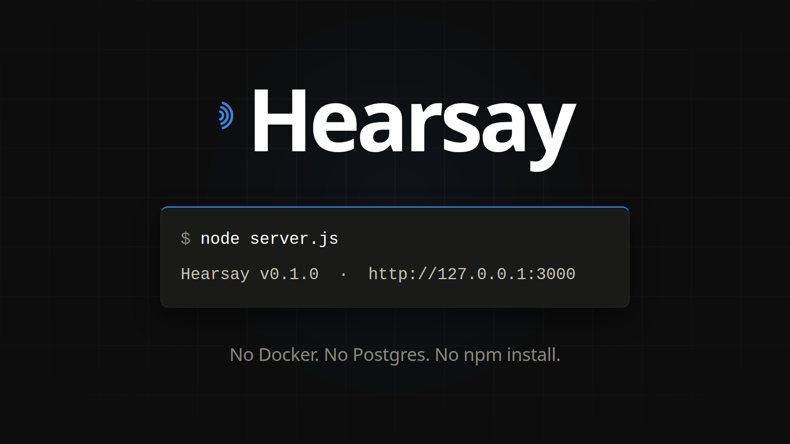
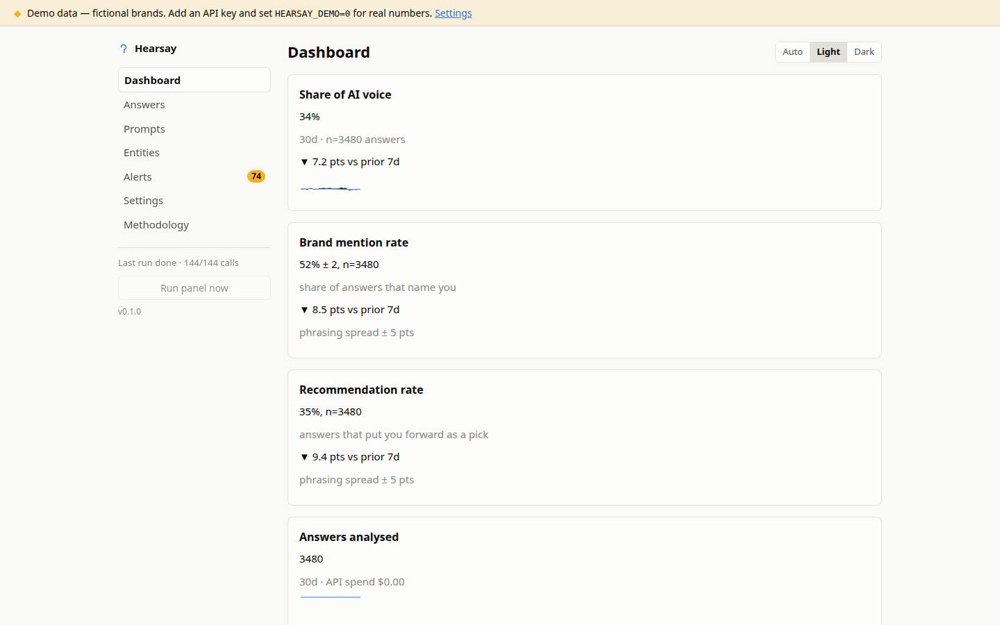
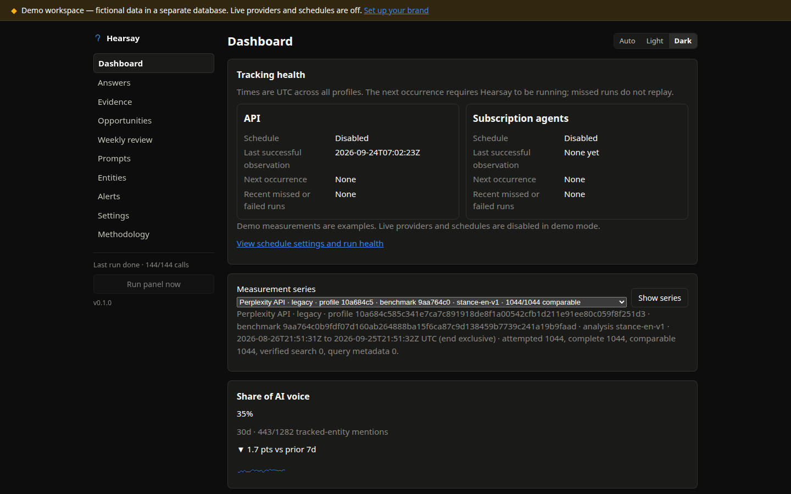
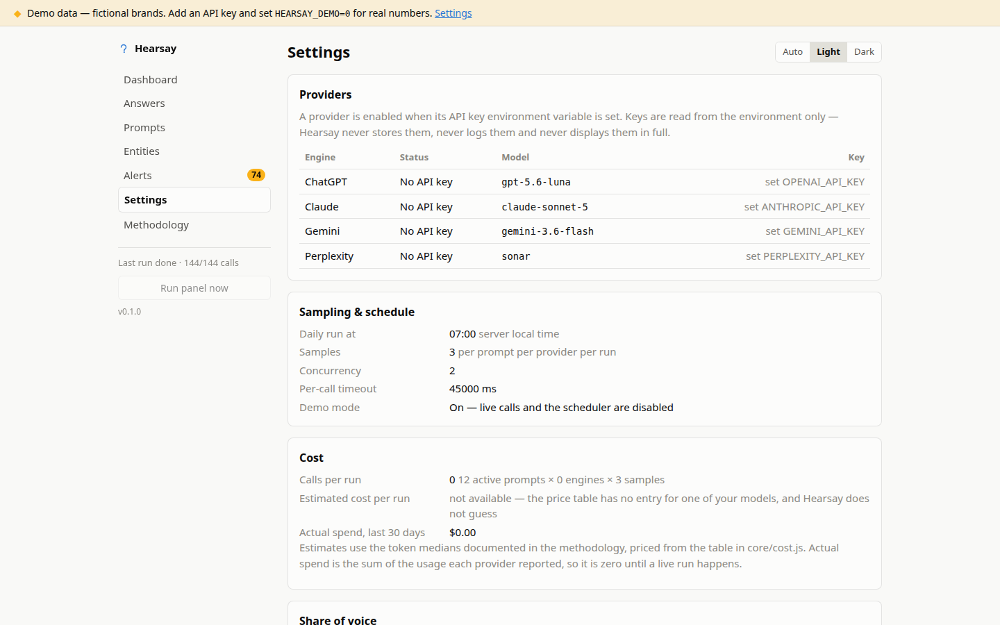

# Hearsay

**AI visibility tracker for humans and agents.** Start with the separately labeled
**Codex agent** and **Claude Code agent** subscription runners when you already have a
supported signed-in CLI. See how those agents talk about your brand versus competitors,
with honest statistics, on your own machine. Optional direct API keys add OpenAI,
Anthropic, Gemini and Perplexity coverage.

[](https://github.com/melonwer/hearsay/actions/workflows/ci.yml)
[](LICENSE)
[](package.json)
[](package.json)
[](mcp/server.mjs)

[](docs/hearsay-launch.mp4)

**[Watch the 64-second tour.](docs/hearsay-launch.mp4)**

## What it does

Your customers now ask ChatGPT and Perplexity which product to buy, and you have no
idea what those answers say about you. The tools that can tell you charge $99 to $1,000
a month and give you back a single score with no margin of error.

Hearsay asks your buying questions several times and counts how often you get mentioned
and recommended. Every rate comes with a margin of error and the number of answers
behind it, and every answer is kept so you can read the exact text any figure came from.
An explicitly enabled Codex agent or Claude Code agent runs through its authenticated
local CLI. Those measurements retain final answers, provider-confirmed web-search
events, citations and redacted event artifacts. They are sibling evidence to API runs,
never a blended score, and they consume the signed-in plan allowance or possible
overage — subscription runs are not free or unlimited.

Direct API keys are optional. Add keys for OpenAI, Anthropic, Gemini and/or Perplexity
when you want direct API measurements and expanded coverage. API providers bill those
questions separately, usually by usage. Hearsay's built-in dollar calculator and actual
spend figure cover API usage only; they do not estimate or report subscription allowance
consumption.

OpenAI API runs can use live web search on `gpt-5.6-luna`. Set
`HEARSAY_OPENAI_SEARCH_POLICY=auto` or `required` to use the Responses API route;
the default `off` keeps the existing Chat Completions request. Search runs always
show a quote before starting. It forecasts one web-search call per target, but the
hosted tool has no enforceable internal call ceiling. The daily API schedule stays
search off until you separately confirm `POST /api/search-schedule` with a
`target_ceiling` and its returned `quoteId`. Changing the execution profile or
exceeding the target ceiling suspends scheduled search. Use
`DELETE /api/search-schedule` to remove recurring search consent. No live provider smoke
test is run automatically.

Anthropic API runs can use the basic server-side web search tool on
`claude-sonnet-5` with `HEARSAY_ANTHROPIC_SEARCH_POLICY=auto`. Hearsay limits
search to three calls per target and one continuation within the target timeout.
The `auto` policy includes complete answers where Claude chooses not to search.
The same on-demand quote and separate daily-schedule consent apply.

## Install it by asking

If you use a supported paid [Claude Code](https://claude.com/claude-code) account, paste
this into Claude Code and it can do the whole setup:

> Install and set up https://github.com/melonwer/hearsay for my brand,
> **[your brand]**, and track it against **[competitor]** and **[competitor]**.
> Skip the demo data. Show me the questions before you save them.

It clones the repo, starts Hearsay, connects itself to it, drafts the buying questions
worth tracking, shows you that list before saving anything, tells you what a run will
cost before spending a cent, and then reports back.

This works because Hearsay speaks MCP (Model Context Protocol), the standard way an AI
assistant plugs into an outside tool. MCP lets Codex and Claude Code operate Hearsay;
it does not make an arbitrary MCP client an inference backend. Hearsay inference runs
come only from the explicitly enabled Codex and Claude Code CLIs or from optional
direct API keys.

<details>
<summary>The exact steps, if your assistant gets stuck</summary>

```sh
git clone https://github.com/melonwer/hearsay && cd hearsay
node --version                        # must be 22.13 or newer

# Skip this line when tracking a real brand. It loads a fictional demo universe,
# and its demo brand then blocks setup for a real one.
node scripts/seed.js

cp .env.example .env                  # subscription flags and optional API keys go here
node server.js > hearsay.log 2>&1 &   # redirect, or a backgrounded server hangs the shell
curl -s "http://127.0.0.1:$(tr -d '\\n' < data/hearsay.port)/api/status"   # repeat until this returns JSON

# Add the MCP server for the client you use (see the subscription sections below).
codex mcp add hearsay -- node "$PWD/mcp/server.mjs"
claude mcp add -s user hearsay -- node "$PWD/mcp/server.mjs"
```

Hearsay's tools appear only after the assistant reconnects. Quit Claude Code and start
it again, then say "carry on setting up Hearsay". If they still do not show up, work
over the JSON API instead, which needs no setup: `GET /api/status`,
`POST /api/setup/drafts`, `GET /api/setup/drafts/:id/review`,
`POST /api/setup/drafts/:id/approve`, `GET /api/cost/estimate`, `POST /api/run`, `GET /api/runs/latest`,
`GET /api/series`, `GET /api/series/summary`, `GET /api/series/evidence?series_id=...&intent_id=...`,
`GET /api/answers?series_id=...`,
`GET /api/alerts`. `GET /api/summary?days=30` remains the legacy API view. There
is no index page at `/api`.

The Evidence page groups the buyer questions, observed search queries, source observations,
final-answer citations, and answer receipts for one selected measurement series. Open a
group's supporting receipts to inspect the recorded action and source links. Query counts
describe this configured panel, not customer search demand. Manual theme labels are
separate from the provider's wording. The [evidence report guide](docs/evidence-report.md)
explains the denominators and unknown associations.

The Opportunities page turns selected receipts and repeated patterns into a reviewable
shortlist. Each observed finding links to the answer and evidence IDs in one exact series
and window. You can prioritize, dismiss, combine, or investigate a candidate. Page-change
actions need reviewed page evidence, and assistant proposals need human acceptance.
See [review evidence-backed opportunities](docs/opportunities.md).
The same page records shipped changes and versioned follow-up plans against the saved baseline.
See [compare a shipped change](docs/intervention-comparison.md) for the report's weighting,
coverage, and interpretation rules.

The setup wizard asks who buys, what job they need done, and the desired conversion.
It offers five editable intent groups with three phrasings each, then shows the exact
questions and first-run target count before approval. Fewer questions are fine.
You can draft without any provider key or subscription route. A run needs at least
one configured route. Source notes stay local; only approved question wording is
sent for measurement. Language and market are planning preferences, not enforced
provider controls. See the [benchmark setup guide](docs/benchmark-setup.md).

MCP access and inference enablement are separate. Registering the Hearsay MCP server
lets a client operate Hearsay; setting `HEARSAY_CODEX_ENABLED=1` or
`HEARSAY_CLAUDE_CODE_ENABLED=1` separately opts that specific signed-in CLI into
Hearsay measurements. Other MCP clients can operate Hearsay but are not inference
backends.

Already loaded the demo data and now want to track your own brand? Stop Hearsay, delete
`data/hearsay.db`, and start it again. That clears the fictional brand that would
otherwise block setup.
</details>

## Or install it yourself

**First, install Node.js 22.13 or newer** from [nodejs.org](https://nodejs.org). Pick
the installer for Mac or Windows and click through it. Hearsay needs that version
because it includes the small built-in database it stores your data in, which is why
there is nothing else to install: no extra packages, no build step, no separate
database server.

The lines below go in a terminal, which is the Terminal app on Mac or PowerShell on
Windows. You also need Git ([git-scm.com](https://git-scm.com/downloads)); if you would
rather not install it, use the green **Code → Download ZIP** button at the top of this
page, unzip it, and skip the first line.

```sh
git clone https://github.com/melonwer/hearsay && cd hearsay
node scripts/seed.js && node server.js
```

The window will look like it has frozen. That is Hearsay running. Leave it open and
visit the URL printed by Hearsay, which is an address on your own computer, published
nowhere. The selected port is also kept in `data/hearsay.port`. To stop it, click the
terminal window and press Ctrl+C.

You are now looking at a fictional demo brand called Notewell, so you can click through
every screen before spending anything.

<details>
<summary>If something goes wrong</summary>

`command not found: node` means Node.js is not installed; get the LTS build from
[nodejs.org](https://nodejs.org). `command not found: git` means Git is missing; on Mac
run `xcode-select --install`, on Windows use [git-scm.com](https://git-scm.com/downloads).
`ERR_UNKNOWN_BUILTIN_MODULE` means your Node is older than 22.13. `EADDRINUSE` means
you explicitly selected a fixed `PORT` that another process is using; remove that
setting or use `PORT=0` for automatic selection. If a reverse proxy needs a fixed
port, choose an available one with `PORT=3100 node server.js`.
</details>

### Track your own brand

1. Stop Hearsay (Ctrl+C) and delete the file `data/hearsay.db`. That removes the demo
   brand, which would otherwise block your own.
2. In the `hearsay` folder, copy `.env.example` to a new file called `.env`
   (`cp .env.example .env` in the terminal).
3. Run `node server.js` again and open the printed local URL with `/setup` appended in
   your browser. The port is also available with `tr -d '\\n' < data/hearsay.port`.
   Type that address in; there is no link to it in the menu. Draft and review buyer
   questions here without a provider key.
4. Before running, choose a signed-in Codex or Claude Code subscription runner below,
   or add an optional direct API key such as `OPENAI_API_KEY=sk-...`. One route is enough.

### Use a Codex subscription runner

Codex measurements use the local authenticated CLI and the allowance of your supported
Codex subscription plan. They are not measurements of the ChatGPT web app. Subscription
usage is not free or unlimited and may incur overage.

```sh
codex login
codex login status
```

Add this line to `.env`, then restart Hearsay:

```dotenv
HEARSAY_CODEX_ENABLED=1
```

Register Hearsay as an MCP server for Codex from the repository directory:

```sh
codex mcp add hearsay -- node "$PWD/mcp/server.mjs"
```

### Use a Claude Code subscription runner

Claude Code requires a supported paid Pro, Max, Team, Enterprise or Console account;
the free `claude.ai` plan does not include Claude Code. Claude Code measurements use
the local authenticated CLI and its plan allowance. They are not measurements of
Claude.ai. Subscription usage is not free or unlimited and may incur overage.

Authenticate in the terminal with `claude auth login`, or start `claude` and complete
the browser login, then verify it:

```sh
claude auth login
claude auth status
```

Add this line to `.env`, then restart Hearsay:

```dotenv
HEARSAY_CLAUDE_CODE_ENABLED=1
```

Register Hearsay for every Claude Code session from the repository directory:

```sh
claude mcp add -s user hearsay -- node "$PWD/mcp/server.mjs"
```

### Optional direct API providers

API keys are optional and independent of the subscription flags. Add one or more of
`OPENAI_API_KEY`, `ANTHROPIC_API_KEY`, `GEMINI_API_KEY` and `PERPLEXITY_API_KEY` to
`.env` when you want direct API measurements and Gemini or Perplexity coverage. The
API cost calculator and actual-spend figure apply to these API calls only; they do not
turn subscription allowance into a dollar estimate.

### Connect an AI assistant

Run this from inside the `hearsay` folder. The `$PWD` part fills in the full path for
you, so there is nothing to edit:

```sh
claude mcp add -s user hearsay -- node "$PWD/mcp/server.mjs"
```

When Hearsay uses the default `PORT=0`, this MCP server discovers the selected local
port from `data/hearsay.port`; no port argument is needed. For a fixed or remote
deployment, set `HEARSAY_URL` in the MCP server environment instead.

For Claude Desktop, open Settings → Developer → **Edit Config**, which opens
`claude_desktop_config.json` for you. Run `pwd` inside the `hearsay` folder to print its
full path, then paste the block below, replacing `YOUR_PATH`. If the file already has an
`mcpServers` section, add the `"hearsay"` entry inside it rather than replacing
everything. Quit Claude Desktop completely and reopen it afterwards.

```json
{ "mcpServers": { "hearsay": { "command": "node", "args": ["YOUR_PATH/mcp/server.mjs"] } } }
```

Now ask it "how's our AI visibility this week?" and it answers from your own
measurements. The tools cover setup, exploration questions, exact-surface
subscription previews/runs, scheduling, cost quotes, results and alerts. Your
assistant uses its own model to talk to you. Reading results does not trigger a new
Hearsay measurement run or optional provider-API spend; the assistant interaction
follows that assistant client's own plan/usage.

There is an optional skill that teaches an assistant the full playbook, including how to
read the numbers honestly. Install it with
`mkdir -p ~/.claude/skills && cp -r skill ~/.claude/skills/hearsay-ai-visibility`, where
`~` means your home folder, or just ask your assistant to install `skill/SKILL.md`.

<!-- TODO: record docs/demo.gif (a real Claude Code session) and embed it here. -->

<p>
  
  
</p>

Light and dark themes. Clicking any figure opens the answers it was calculated from.

## Why it exists

68% of US Google searches end without a click (SparkToro, June 2026, on January to
April 2026 US clickstream data,
[study](https://sparktoro.com/blog/in-2026-less-than-one-third-of-google-searches-still-send-a-click/)),
and where an AI Overview appears, on more than 20% of searches,
[the share of those searches that produce a click falls by nearly 60%](https://searchengineland.com/google-zero-click-searches-2026-study-479717).
Buying research is moving into AI answers, and the tools that measure it charge by the
piece. Profound's $99/mo entry tier covers ChatGPT only, with Claude, API access and
single sign-on locked behind an Enterprise plan
([pricing](https://www.tryprofound.com/pricing)). Otterly charges $29 to $439/mo extra
just to add Claude ([pricing](https://otterly.ai/pricing/)). Semrush meters $99/mo *per
domain* for 25 prompts ([pricing](https://www.semrush.com/pricing/ai/)). Agencies have
started
[building their own trackers to escape $99 to $1,000/mo pricing](https://digiday.com/marketing/marketers-question-expensive-ai-visibility-tools-as-inconsistent-results-fuel-skepticism/).

Hearsay is a measurement method you can run anywhere. It asks each question repeatedly,
publishes the margin of error, keeps the answers behind every figure, and hands the
whole job to your AI assistant if you would rather not click through a dashboard.

## What you get

Every rate is measured by asking the same question many times and counting, and each one
is published with a margin of error (a Wilson 95% confidence interval) and the number of
answers it came from. A figure resting on fewer than five answers is labelled low
sample.

Questions are grouped into intents, meaning one buying question written several ways.
Hearsay shows you how much the answers move when you ask again, and separately how much
they move when you reword the question. Rewording moves them more, which is why
single-prompt tracking is unstable.

Every answer is stored and searchable, and every metric links to the answers behind it.
The citation gap report shows which websites get cited instead of you, domain by domain,
in the answers where your brand never comes up. Alerts fire when your mentions drop,
when a competitor passes you, and when you win or lose a recommendation, each one
carrying the answers that triggered it.

The cost calculator estimates direct API usage before an API run starts and records a
computed usage cost afterwards. It shows a known subtotal when some billing units are
unknown; these figures are not an invoice. Subscription runs consume the signed-in
Codex or Claude Code plan allowance and may incur overage, so they are not represented
as a dollar estimate here.

### What Hearsay refuses to build

It will not give you a single blended "AI visibility score", because one number hides
the uncertainty the tool exists to show you. It will not claim rank positions, because
AI answers change between identical runs, so there is no stable "position 3" to report.
It will not estimate how many people ask a given question, because nobody has that data,
and a made-up figure would corrupt every number sitting next to it. And it will not
write your content, because a measuring instrument that also produces the thing it
measures cannot be trusted about either.

## What it costs to run

Hearsay itself has no paid edition or hosted fee. A Codex or Claude Code subscription
runner uses the allowance of the signed-in plan and may incur overage; it is not free or
unlimited. Optional direct API runs are billed by the API providers you configure. What
an API run costs depends on how many questions you track, how many API providers you
ask, and how many samples you take, so the built-in calculator estimates that API usage
before each run and records computed API usage costs afterwards. Unknown charges stay
visible as unknown, with any known subtotal shown separately. It does not estimate
subscription allowance in dollars.



## How it compares

Checked against each vendor's public pricing page on 2026-07-26, except the Peec figures,
which come from a [third-party pricing review](https://trakkr.ai/reviews/peec-review/pricing)
of the same date rather than from peec.ai.

| | Hearsay | [Profound](https://www.tryprofound.com/pricing) | [Peec AI](https://trakkr.ai/reviews/peec-review/pricing) | [elmo](https://github.com/elmohq/elmo) |
|---|---|---|---|---|
| Price | Free; subscription runs use your existing plan allowance and may incur overage; optional API runs are billed directly by those providers | $99/mo entry (ChatGPT only) → $399/mo → Enterprise | $95 to $495/mo, Enterprise custom | Free |
| License | MIT | Proprietary SaaS | Proprietary SaaS | MIT |
| Engines | Codex agent and Claude Code agent through signed-in CLIs; optional OpenAI, Anthropic, Gemini and Perplexity APIs | Entry tier: ChatGPT only; Claude Enterprise-gated | 3 of 6 engines on self-serve tiers | ChatGPT, Claude, Perplexity, Gemini, AI Overviews |
| Margin of error | Wilson 95% intervals, plus rerun and rewording spread reported separately | None published | None published | None |
| Stored answers | Every answer kept, searchable, linked from every metric | Answer-engine responses on paid tiers | Prompt-level views on paid tiers | Stores responses |
| Assistant access | MCP and JSON API built in; Codex/Claude Code can operate Hearsay and supply their configured subscription measurements; other MCP clients operate Hearsay but are not runners | API on Enterprise only | API and MCP as higher-tier add-ons | None |
| What you install | Node plus any signed-in CLI you choose; API-only needs keys; core data is one file plus local subscription artifacts (`git clone` plus `node server.js`) | Nothing, it is hosted | Nothing, it is hosted | Container and database software first (Docker Compose, Postgres, pg-boss) |

## Methodology

Three things worth knowing before you read any number, from
[METHODOLOGY.md](METHODOLOGY.md) (also served at `/methodology`):

Reword a question and the two answers overlap in only 14% to 29% of the brands they
recommend. Ask the identical question twice and the overlap is 50% to 61%
([arXiv:2605.27440](https://arxiv.org/pdf/2605.27440)). So Hearsay asks each question
several ways and shows you both numbers.

Answers from the direct APIs are not the same as what a logged-in person sees in the
ChatGPT app, and Codex agent or Claude Code agent results are not measurements of the
ChatGPT web app or Claude.ai. API answers have no memory of the user, no personalisation
and none of the hidden instructions the consumer apps add. Treat each configured route
as its own directional baseline; no amount of extra sampling makes sibling surfaces a
single comparable score.

The channel is still small. Under 0.2% of e-commerce visits come from AI tools
([organicllm.org](https://organicllm.org)), though complex, considered purchases run
several times higher. Hearsay's costs are built for a channel that size.

## No cloud version, no lock-in

> MIT licensed, one license, with no separate paid edition and no gated features.
> Everything in this repo is everything there is, and no hosted version is planned.
> Hearsay runs locally and does not collect telemetry. Direct API prompts go only to
> the API providers whose keys you configure; subscription prompts go through the
> explicitly enabled, locally authenticated Codex or Claude Code CLI and its provider.
> MCP clients can operate your local Hearsay instance, but are not inference backends
> unless one of those supported runners is enabled. Core records live in
> `data/hearsay.db`; subscription runs may also write redacted event artifacts under
> `data/artifacts/` (or your configured `HEARSAY_DATA_DIR`), so back up both when needed.
> The `/api/export` endpoint at
> `http://127.0.0.1:<the-port-in-data/hearsay.port>/api/export` exports all database
> records — questions, runs, answers and metrics — as one JSON file. It does not package
> artifact files; back up `data/artifacts/` (or your configured `HEARSAY_DATA_DIR`)
> separately.

## Roadmap

v1.1 brings pushed alerts first, using webhooks, so a drop in mentions can fire straight
into Slack or email. Then multi-client workspaces with white-label HTML and PDF reports,
opt-in sentiment scoring that uses your existing keys, CSV export, and a Docker image
for people who want one.

v1.2 adds Google AI Overviews per question through an optional search API, more engines
(Grok, DeepSeek, Copilot), and shared prompt packs from the community. v2 adds trend
annotations, so you can mark the day you shipped the comparison page.

## Contributing and security

[CONTRIBUTING.md](CONTRIBUTING.md) covers the no-dependencies rule, how to run the
tests, and where the good first issues are. [SECURITY.md](SECURITY.md) covers the
localhost default, how API keys are handled, and how to report a vulnerability.

Not affiliated with OpenAI, Anthropic, Google or Perplexity; trademarks belong to their
owners.

[MIT](LICENSE).
